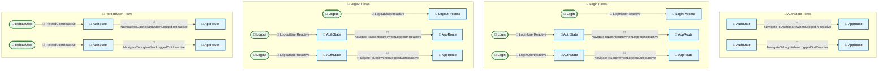

```mermaid

graph TD

  AuthStateComponent_F0_N0_AuthStateComponent["🔧 AuthState"]:::component
  AuthStateComponent_F0_N1_AppRouteComponent["🔧 AppRoute"]:::component
  %% Flow 1 from AuthState
  AuthStateComponent_F1_N0_AuthStateComponent["🔧 AuthState"]:::component
  AuthStateComponent_F1_N1_AppRouteComponent["🔧 AppRoute"]:::component
  %% Flow 2 from AuthState
  LoginEvent_F0_N0_LoginEvent(["🚀 Login"]):::event
  LoginEvent_F0_N1_LoginProcessComponent["🔧 LoginProcess"]:::component
  %% Flow 1 from Login
  LoginEvent_F1_N0_LoginEvent(["🚀 Login"]):::event
  LoginEvent_F1_N1_AuthStateComponent["🔧 AuthState"]:::component
  LoginEvent_F1_N2_AppRouteComponent["🔧 AppRoute"]:::component
  %% Flow 2 from Login
  LoginEvent_F2_N0_LoginEvent(["🚀 Login"]):::event
  LoginEvent_F2_N1_AuthStateComponent["🔧 AuthState"]:::component
  LoginEvent_F2_N2_AppRouteComponent["🔧 AppRoute"]:::component
  %% Flow 3 from Login
  LogoutEvent_F0_N0_LogoutEvent(["🚀 Logout"]):::event
  LogoutEvent_F0_N1_LogoutProcessComponent["🔧 LogoutProcess"]:::component
  %% Flow 1 from Logout
  LogoutEvent_F1_N0_LogoutEvent(["🚀 Logout"]):::event
  LogoutEvent_F1_N1_AuthStateComponent["🔧 AuthState"]:::component
  LogoutEvent_F1_N2_AppRouteComponent["🔧 AppRoute"]:::component
  %% Flow 2 from Logout
  LogoutEvent_F2_N0_LogoutEvent(["🚀 Logout"]):::event
  LogoutEvent_F2_N1_AuthStateComponent["🔧 AuthState"]:::component
  LogoutEvent_F2_N2_AppRouteComponent["🔧 AppRoute"]:::component
  %% Flow 3 from Logout
  ReloadUserEvent_F0_N0_ReloadUserEvent(["🚀 ReloadUser"]):::event
  ReloadUserEvent_F0_N1_AuthStateComponent["🔧 AuthState"]:::component
  ReloadUserEvent_F0_N2_AppRouteComponent["🔧 AppRoute"]:::component
  %% Flow 1 from ReloadUser
  ReloadUserEvent_F1_N0_ReloadUserEvent(["🚀 ReloadUser"]):::event
  ReloadUserEvent_F1_N1_AuthStateComponent["🔧 AuthState"]:::component
  ReloadUserEvent_F1_N2_AppRouteComponent["🔧 AppRoute"]:::component
  %% Flow 2 from ReloadUser

  AuthStateComponent_F0_N0_AuthStateComponent -->|"🔄 NavigateToDashboardWhenLoggedInReactive"| AuthStateComponent_F0_N1_AppRouteComponent
  AuthStateComponent_F1_N0_AuthStateComponent -->|"🔄 NavigateToLoginWhenLoggedOutReactive"| AuthStateComponent_F1_N1_AppRouteComponent
  LoginEvent_F0_N0_LoginEvent -->|"🔄 LoginUserReactive"| LoginEvent_F0_N1_LoginProcessComponent
  LoginEvent_F1_N0_LoginEvent -->|"🔄 LoginUserReactive"| LoginEvent_F1_N1_AuthStateComponent
  LoginEvent_F1_N1_AuthStateComponent -->|"🔄 NavigateToDashboardWhenLoggedInReactive"| LoginEvent_F1_N2_AppRouteComponent
  LoginEvent_F2_N0_LoginEvent -->|"🔄 LoginUserReactive"| LoginEvent_F2_N1_AuthStateComponent
  LoginEvent_F2_N1_AuthStateComponent -->|"🔄 NavigateToLoginWhenLoggedOutReactive"| LoginEvent_F2_N2_AppRouteComponent
  LogoutEvent_F0_N0_LogoutEvent -->|"🔄 LogoutUserReactive"| LogoutEvent_F0_N1_LogoutProcessComponent
  LogoutEvent_F1_N0_LogoutEvent -->|"🔄 LogoutUserReactive"| LogoutEvent_F1_N1_AuthStateComponent
  LogoutEvent_F1_N1_AuthStateComponent -->|"🔄 NavigateToDashboardWhenLoggedInReactive"| LogoutEvent_F1_N2_AppRouteComponent
  LogoutEvent_F2_N0_LogoutEvent -->|"🔄 LogoutUserReactive"| LogoutEvent_F2_N1_AuthStateComponent
  LogoutEvent_F2_N1_AuthStateComponent -->|"🔄 NavigateToLoginWhenLoggedOutReactive"| LogoutEvent_F2_N2_AppRouteComponent
  ReloadUserEvent_F0_N0_ReloadUserEvent -->|"🔄 ReloadUserReactive"| ReloadUserEvent_F0_N1_AuthStateComponent
  ReloadUserEvent_F0_N1_AuthStateComponent -->|"🔄 NavigateToDashboardWhenLoggedInReactive"| ReloadUserEvent_F0_N2_AppRouteComponent
  ReloadUserEvent_F1_N0_ReloadUserEvent -->|"🔄 ReloadUserReactive"| ReloadUserEvent_F1_N1_AuthStateComponent
  ReloadUserEvent_F1_N1_AuthStateComponent -->|"🔄 NavigateToLoginWhenLoggedOutReactive"| ReloadUserEvent_F1_N2_AppRouteComponent

  subgraph SG_AuthStateComponent ["🚀 AuthState Flows"]
    AuthStateComponent_F0_N0_AuthStateComponent
    AuthStateComponent_F0_N1_AppRouteComponent
    AuthStateComponent_F1_N0_AuthStateComponent
    AuthStateComponent_F1_N1_AppRouteComponent
  end

  subgraph SG_LoginEvent ["🚀 Login Flows"]
    LoginEvent_F0_N0_LoginEvent
    LoginEvent_F0_N1_LoginProcessComponent
    LoginEvent_F1_N0_LoginEvent
    LoginEvent_F1_N1_AuthStateComponent
    LoginEvent_F1_N2_AppRouteComponent
    LoginEvent_F2_N0_LoginEvent
    LoginEvent_F2_N1_AuthStateComponent
    LoginEvent_F2_N2_AppRouteComponent
  end

  subgraph SG_LogoutEvent ["🚀 Logout Flows"]
    LogoutEvent_F0_N0_LogoutEvent
    LogoutEvent_F0_N1_LogoutProcessComponent
    LogoutEvent_F1_N0_LogoutEvent
    LogoutEvent_F1_N1_AuthStateComponent
    LogoutEvent_F1_N2_AppRouteComponent
    LogoutEvent_F2_N0_LogoutEvent
    LogoutEvent_F2_N1_AuthStateComponent
    LogoutEvent_F2_N2_AppRouteComponent
  end

  subgraph SG_ReloadUserEvent ["🚀 ReloadUser Flows"]
    ReloadUserEvent_F0_N0_ReloadUserEvent
    ReloadUserEvent_F0_N1_AuthStateComponent
    ReloadUserEvent_F0_N2_AppRouteComponent
    ReloadUserEvent_F1_N0_ReloadUserEvent
    ReloadUserEvent_F1_N1_AuthStateComponent
    ReloadUserEvent_F1_N2_AppRouteComponent
  end

  classDef component fill:#e1f5fe,stroke:#01579b,stroke-width:2px,color:#000
  classDef event fill:#e8f5e8,stroke:#2e7d32,stroke-width:2px,color:#000
  classDef default fill:#f5f5f5,stroke:#757575,stroke-width:2px,color:#000
  classDef circular fill:#ffebee,stroke:#d32f2f,stroke-width:3px,color:#d32f2f
```