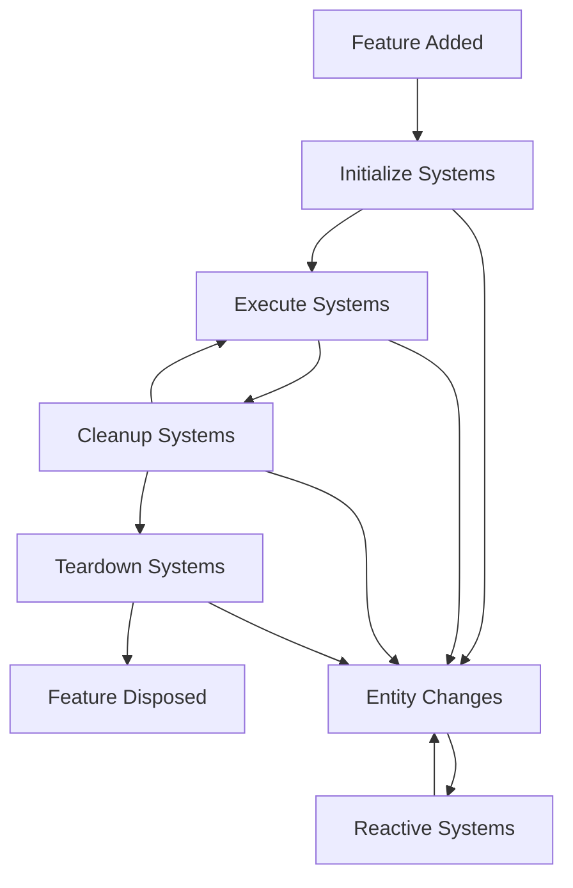

# Flutter Event Component System (ECS)

[](https://choosealicense.com/licenses/mit/)
[](https://flutter.dev)
[](https://dart.dev)

A powerful and flexible **Event-Component-System (ECS)** architecture pattern implementation for Flutter applications. This package provides a reactive state management solution that promotes clean architecture, separation of concerns, and scalable application development.

## 🌟 Features

### Core Architecture

- **🏗️ Entity-Component-System Pattern**: Clean separation between data (Components), behavior (Systems), and events
- **⚡ Reactive Programming**: Automatic UI updates when components change
- **🔄 Event-Driven**: Decoupled communication through events and reactive systems
- **🎯 Type-Safe**: Full TypeScript-like type safety with Dart generics
- **🧩 Modular Design**: Organize code into reusable features

### Advanced Capabilities

- **🔍 Built-in Inspector**: Real-time debugging and visualization tools
- **📊 Flow Analysis**: Detect circular dependencies and cascade flows
- **📈 Performance Monitoring**: Track system interactions and entity changes
- **🌐 Graph Visualization**: Interactive dependency graphs
- **📝 Comprehensive Logging**: Detailed system activity tracking

### Developer Experience

- **🛠️ Widget Integration**: Seamless Flutter widget integration
- **🎨 Reactive Widgets**: Automatic rebuilds on component changes
- **🔧 Debugging Tools**: Visual inspector with filtering and search
- **📋 Cascade Analysis**: Understand data flow and dependencies
- **⚙️ Hot Reload Support**: Full development workflow integration

## 🚀 Quick Start

### Installation

Add this package to your `pubspec.yaml`:

```yaml
dependencies:
  flutter_event_component_system:
    git: 
      url: https://github.com/FlameOfUdun/flutter_event_component_system.git
      ref: main
```

### Basic Usage

#### 1. Define Components and Events

```dart
// Components hold state data
class CounterComponent extends ECSComponent<int> {
  CounterComponent([super.value = 0]);
}

// Events trigger actions
class IncrementEvent extends ECSEvent {
  IncrementEvent();
}
```

#### 2. Create Reactive Systems

```dart
// Systems define behavior and reactions
class IncrementCounterSystem extends ReactiveSystem {
  IncrementCounterSystem();

  @override
  Set<Type> get reactsTo => {IncrementEvent};
  
  @override
  Set<Type> get interactsWith => {CounterComponent};

  @override
  void react() {
    final counter = getEntity<CounterComponent>();
    counter.update(counter.value + 1);
  }
}
```

#### 3. Organize into Features

```dart
class CounterFeature extends ECSFeature {
  CounterFeature() {
    // Add components
    addEntity(CounterComponent());
    addEntity(IncrementEvent());
    
    // Add systems
    addSystem(IncrementCounterSystem());
  }
}
```

#### 4. Setup ECS Scope

```dart
class MyApp extends StatelessWidget {
  @override
  Widget build(BuildContext context) {
    return ECSScope(
      features: {
        CounterFeature(),
      },
      child: MaterialApp(
        home: CounterPage(),
      ),
    );
  }
}
```

#### 5. Create Reactive Widgets

```dart
class CounterPage extends ECSWidget {
  @override
  Widget build(BuildContext context, ECSContext ecs) {
    final counter = ecs.watch<CounterComponent>();
    final incrementEvent = ecs.get<IncrementEvent>();
    
    return Scaffold(
      appBar: AppBar(title: Text('Counter')),
      body: Center(
        child: Text('Count: ${counter.value}'),
      ),
      floatingActionButton: FloatingActionButton(
        onPressed: incrementEvent.trigger,
        child: Icon(Icons.add),
      ),
    );
  }
}
```

## 🏛️ Architecture Overview

### Core Concepts

#### **Entities**

Base building blocks that can be either Components or Events:

- **Components**: Hold state data with automatic change notification
- **Events**: Trigger actions and system reactions

#### **Systems**

Define behavior and business logic:

- **InitializeSystem**: Setup tasks on feature initialization
- **ExecuteSystem**: Frame-based continuous execution
- **ReactiveSystem**: React to entity changes
- **CleanupSystem**: Cleanup tasks after each frame
- **TeardownSystem**: Cleanup on feature disposal

#### **Features**

Organize related entities and systems into cohesive modules:

```dart
class UserAuthFeature extends ECSFeature {
  UserAuthFeature() {
    // Components
    addEntity(AuthStateComponent());
    addEntity(LoginCredentialsComponent());
    
    // Events  
    addEntity(LoginEvent());
    addEntity(LogoutEvent());
    
    // Systems
    addSystem(LoginUserReactiveSystem());
    addSystem(LogoutUserReactiveSystem());
  }
}
```

#### **Manager**

Central coordinator that:

- Manages all features and their lifecycles
- Coordinates system execution
- Handles entity change notifications
- Provides entity lookup and access

### System Lifecycle



## 🎯 Advanced Features

### Reactive Widget Integration

#### ECSWidget

Automatically rebuilds when watched components change:

```dart
class ProfileWidget extends ECSWidget {
  @override
  Widget build(BuildContext context, ECSContext ecs) {
    final user = ecs.watch<UserComponent>();
    final auth = ecs.watch<AuthStateComponent>();
    
    return Column(
      children: [
        Text('Welcome ${user.value.name}'),
        Text('Status: ${auth.value}'),
      ],
    );
  }
}
```

#### ECSBuilder

Functional approach for simple reactive widgets:

```dart
ECSBuilder<UserComponent>(
  builder: (context, ecs) {
    final user = ecs.watch<UserComponent>();
    return Text('Hello ${user.value.name}');
  },
)
```

#### ECSStatefulWidget

For complex widgets requiring local state:

```dart
class ComplexWidget extends ECSStatefulWidget {
  @override
  ECSState<ComplexWidget> createState() => _ComplexWidgetState();
}

class _ComplexWidgetState extends ECSState<ComplexWidget> {
  @override
  Widget build(BuildContext context) {
    final data = ecs.watch<DataComponent>();
    return YourComplexWidget(data: data.value);
  }
}
```

### Event Handling and Listeners

#### Direct Event Listening

```dart
class NotificationWidget extends ECSWidget {
  @override
  Widget build(BuildContext context, ECSContext ecs) {
    // Listen to specific entity
    ecs.listen<ErrorComponent>((entity) {
      ScaffoldMessenger.of(context).showSnackBar(
        SnackBar(content: Text(entity.value.message)),
      );
    });
    
    return YourWidget();
  }
}
```

#### Lifecycle Callbacks

```dart
class LifecycleWidget extends ECSWidget {
  @override
  Widget build(BuildContext context, ECSContext ecs) {
    ecs.onEnter(() {
      print('Widget entered ECS context');
    });
    
    ecs.onExit(() {
      print('Widget exited ECS context');
    });
    
    return YourWidget();
  }
}
```

### System Types and Usage

#### Reactive Systems

Respond to entity changes:

```dart
class ValidationSystem extends ReactiveSystem {
  ValidationSystem();

  @override
  Set<Type> get reactsTo => {FormDataComponent};
  
  @override
  Set<Type> get interactsWith => {ValidationStateComponent};
  
  @override
  bool get reactsIf => true; // Conditional reactions
  
  @override
  void react() {
    final formData = getEntity<FormDataComponent>();
    final validation = getEntity<ValidationStateComponent>();
    
    // Validate form data
    final isValid = validateForm(formData.value);
    validation.update(isValid);
  }
}
```

#### Execute Systems

Continuous frame-based execution:

```dart
class TimerSystem extends ExecuteSystem {
  TimerSystem();

  @override
  Set<Type> get interactsWith => {TimerComponent};

  @override
  executesIf => true; // Conditional executions
  
  @override
  void execute(Duration elapsed) {
    final timer = getEntity<TimerComponent>();
    timer.update(timer.value + elapsed.inMilliseconds);
  }
}
```

#### Initialize/Teardown Systems

Setup and cleanup:

```dart
class DatabaseInitSystem extends InitializeSystem {
  @override
  Set<Type> get interactsWith => {DatabaseComponent};
  
  @override
  void initialize() {
    // Initialize database connection
    print('Database initialized');
  }
}

class DatabaseTeardownSystem extends TeardownSystem {
  @override
  Set<Type> get interactsWith => {DatabaseComponent};
  
  @override
  void teardown() {
    // Close database connection
    print('Database closed');
  }
}
```

## 📊 Real-World Example

### User Authentication System

```dart
// Components
class AuthStateComponent extends ECSComponent<AuthState> {
  AuthStateComponent() : super(AuthState.unauthenticated);
}

class LoginCredentialsComponent extends ECSComponent<LoginCredentials> {
  LoginCredentialsComponent() : super(LoginCredentials.empty());
}

// Events
class LoginEvent extends ECSEvent {
  LoginEvent();
}

class LogoutEvent extends ECSEvent {
  LogoutEvent();
}

// Systems
class LoginUserReactiveSystem extends ReactiveSystem {
  LoginUserReactiveSystem();

  @override
  Set<Type> get reactsTo => {LoginEvent};
  
  @override
  Set<Type> get interactsWith => {AuthStateComponent, LoginCredentialsComponent};

  @override
  void react() async {
    final credentials = getEntity<LoginCredentialsComponent>();
    final authState = getEntity<AuthStateComponent>();
    
    try {
      authState.update(AuthState.loading);
      
      final user = await authenticateUser(credentials.value);
      authState.update(AuthState.authenticated(user));
      
    } catch (error) {
      authState.update(AuthState.error(error.toString()));
    }
  }
}

// Feature
class UserAuthFeature extends ECSFeature {
  UserAuthFeature() {
    addEntity(AuthStateComponent());
    addEntity(LoginCredentialsComponent());
    addEntity(LoginEvent());
    addEntity(LogoutEvent());
    
    addSystem(LoginUserReactiveSystem());
    addSystem(LogoutUserReactiveSystem());
  }
}

// UI Integration
class LoginPage extends ECSWidget {
  @override
  Widget build(BuildContext context, ECSContext ecs) {
    final authState = ecs.watch<AuthStateComponent>();
    final credentials = ecs.get<LoginCredentialsComponent>();
    final loginEvent = ecs.get<LoginEvent>();
    
    return Scaffold(
      appBar: AppBar(title: Text('Login')),
      body: Column(
        children: [
          if (authState.value.isLoading)
            CircularProgressIndicator(),
            
          TextField(
            onChanged: (value) {
              credentials.update(
                credentials.value.copyWith(email: value)
              );
            },
            decoration: InputDecoration(labelText: 'Email'),
          ),
          
          ElevatedButton(
            onPressed: authState.value.isLoading ? null : loginEvent.trigger,
            child: Text('Login'),
          ),
          
          if (authState.value.hasError)
            Text(
              authState.value.error,
              style: TextStyle(color: Colors.red),
            ),
        ],
      ),
    );
  }
}
```

## 🧪 Testing

### Testing Components

```dart
test('component notifies listeners on change', () {
  final component = TestComponent();
  bool notified = false;
  
  component.addListener(TestListener(() => notified = true));
  component.update(42);
  
  expect(notified, isTrue);
  expect(component.value, equals(42));
});
```

### Testing Systems

```dart
test('reactive system processes events', () {
  final manager = ECSManager();
  final feature = TestFeature();
  final system = TestReactiveSystem();
  
  feature.addEntity(TestEvent());
  feature.addSystem(system);
  manager.addFeature(feature);
  manager.activate();
  
  manager.getEntity<TestEvent>().trigger();
  
  expect(system.reacted, isTrue);
});
```

### Testing Features

```dart
test('feature manages entities and systems', () {
  final manager = ECSManager();
  final feature = TestFeature();
  final component = TestComponent();
  final system = TestSystem();
  
  feature.addEntity(component);
  feature.addSystem(system);
  manager.addFeature(feature);
  manager.activate();
  
  expect(feature.entities, contains(component));
  expect(feature.reactiveSystems[TestEvent], contains(system));
});
```

### Widget Testing

```dart
testWidgets('ECS widget rebuilds on component change', (tester) async {
  final feature = TestFeature();

  await tester.pumpWidget(
    ECSScope(
      features: {feature},
      child: TestECSWidget(),
    ),
  );
  
  final component = feature.getEntity<TestComponent>();
  component.update(100);

  await tester.pump();
  
  expect(find.text('100'), findsOneWidget);
});
```

## 🎯 Best Practices

### 1. **Feature Organization**

```dart
// ✅ Good: Organized by domain
features/
  user_auth_feature/
    components/
    events/
    systems/
    user_auth_feature.dart
  
// ❌ Avoid: Mixing concerns
features/
  all_components.dart
  all_events.dart
  all_systems.dart
```

### 2. **Component Design**

```dart
// ✅ Good: Immutable data structures
class UserComponent extends ECSComponent<User> {
  UserComponent(super.value);
  
  void updateName(String name) {
    update(value.copyWith(name: name));
  }
}

// ❌ Avoid: Mutable data
class UserComponent extends ECSComponent<User> {
  UserComponent(super.value);
  
  void updateName(String name) {
    value.name = name; // Don't mutate directly
    notifyListeners(); // Manual notification
  }
}
```

### 3. **System Granularity**

```dart
// ✅ Good: Single responsibility
class ValidateEmailSystem extends ReactiveSystem {
  @override
  Set<Type> get reactsTo => {EmailComponent};
  
  @override
  void react() {
    // Only validate email
  }
}

class ValidatePasswordSystem extends ReactiveSystem {
  @override
  Set<Type> get reactsTo => {PasswordComponent};
  
  @override
  void react() {
    // Only validate password
  }
}

// ❌ Avoid: Multiple responsibilities
class ValidateEverythingSystem extends ReactiveSystem {
  @override
  void react() {
    // Validate email, password, phone, etc.
  }
}
```

### 4. **Error Handling**

```dart
// ✅ Good: Proper error handling
class LoginSystem extends ReactiveSystem {
  @override
  void react() async {
    try {
      final result = await authService.login();
      authState.update(AuthState.authenticated(result));
    } catch (error) {
      errorState.update(ErrorState.fromException(error));
    }
  }
}
```

### Development Setup

1. **Clone the repository**

   ```bash
   git clone https://github.com/FlameOfUdun/flutter_event_component_system.git
   cd flutter_event_component_system
   ```

2. **Install dependencies**

   ```bash
   flutter pub get
   ```

3. **Run tests**

   ```bash
   flutter test
   ```

4. **Run example**

   ```bash
   cd example
   flutter run
   ```

### Code Style

This project follows the [Dart Style Guide](https://dart.dev/guides/language/effective-dart/style) and uses `flutter_lints` for code analysis.

## 📄 License

This project is licensed under the MIT License - see the [LICENSE](LICENSE) file for details.

## 🙏 Acknowledgments

- Inspired by the Entity-Component-System pattern from game development
- Built for the Flutter community with ❤️
- Special thanks to all contributors and users

## 📞 Support

- **Issues**: [GitHub Issues](https://github.com/FlameOfUdun/flutter_event_component_system/issues)
- **Discussions**: [GitHub Discussions](https://github.com/FlameOfUdun/flutter_event_component_system/discussions)

---

**Made with ❤️ by [FlameOfUdun](https://github.com/FlameOfUdun)**
