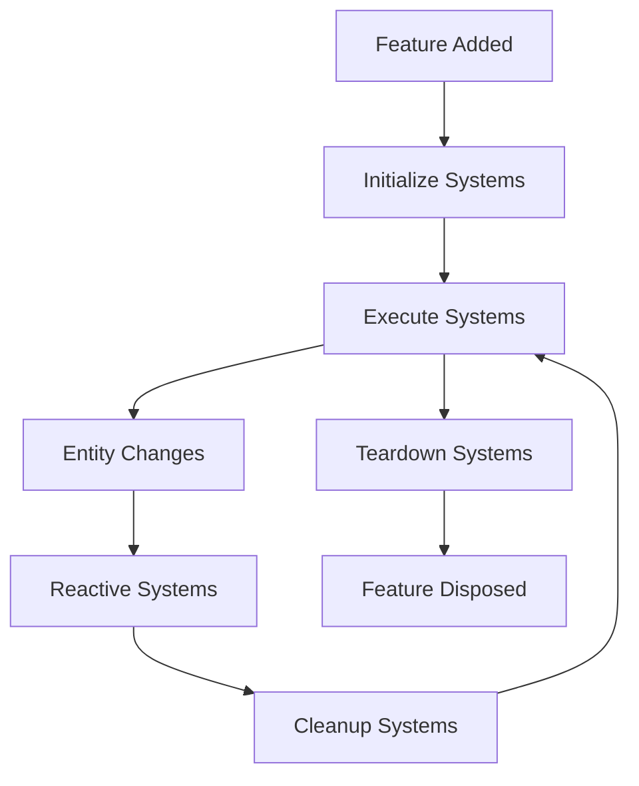

# Flutter Event Component System (ECS)

[](https://choosealicense.com/licenses/mit/)
[](https://flutter.dev)
[](https://dart.dev)

A powerful and flexible **Event-Component-System (ECS)** architecture pattern implementation for Flutter applications. This package provides a reactive state management solution that promotes clean architecture, separation of concerns, and scalable application development.

## 🌟 Features

### Core Architecture

- **🏗️ Entity-Component-System Pattern**: Clean separation between data (Components), behavior (Systems), and events
- **⚡ Reactive Programming**: Automatic UI updates when components change
- **🔄 Event-Driven**: Decoupled communication through events and reactive systems
- **🎯 Type-Safe**: Full TypeScript-like type safety with Dart generics
- **🧩 Modular Design**: Organize code into reusable features

### Advanced Capabilities

- **🔍 Built-in Inspector**: Real-time debugging and visualization tools
- **📊 Flow Analysis**: Detect circular dependencies and cascade flows
- **📈 Performance Monitoring**: Track system interactions and entity changes
- **🌐 Graph Visualization**: Interactive dependency graphs
- **📝 Comprehensive Logging**: Detailed system activity tracking

### Developer Experience

- **🛠️ Widget Integration**: Seamless Flutter widget integration
- **🎨 Reactive Widgets**: Automatic rebuilds on component changes
- **🔧 Debugging Tools**: Visual inspector with filtering and search
- **📋 Cascade Analysis**: Understand data flow and dependencies
- **⚙️ Hot Reload Support**: Full development workflow integration

## 🚀 Quick Start

### Installation

Add this package to your `pubspec.yaml`:

```yaml
dependencies:
  flutter_event_component_system: ^0.0.1
```

### Basic Usage

#### 1. Define Components and Events

```dart
// Components hold state data
class CounterComponent extends ECSComponent<int> {
  CounterComponent([super.value = 0]);
}

// Events trigger actions
class IncrementEvent extends ECSEvent {
  IncrementEvent();
}
```

#### 2. Create Reactive Systems

```dart
// Systems define behavior and reactions
class IncrementCounterSystem extends ReactiveSystem {
  IncrementCounterSystem();

  @override
  Set<Type> get reactsTo => {IncrementEvent};
  
  @override
  Set<Type> get interactsWith => {CounterComponent};

  @override
  void react() {
    final counter = manager.getEntity<CounterComponent>();
    counter.update(counter.value + 1);
  }
}
```

#### 3. Organize into Features

```dart
class CounterFeature extends ECSFeature {
  CounterFeature() {
    // Add components
    addEntity(CounterComponent());
    addEntity(IncrementEvent());
    
    // Add systems
    addSystem(IncrementCounterSystem());
  }
}
```

#### 4. Setup ECS Scope

```dart
class MyApp extends StatelessWidget {
  @override
  Widget build(BuildContext context) {
    return ECSScope(
      features: {
        CounterFeature(),
      },
      child: MaterialApp(
        home: CounterPage(),
      ),
    );
  }
}
```

#### 5. Create Reactive Widgets

```dart
class CounterPage extends ECSWidget {
  @override
  Widget build(BuildContext context, ECSContext ecs) {
    final counter = ecs.watch<CounterComponent>();
    final incrementEvent = ecs.get<IncrementEvent>();
    
    return Scaffold(
      appBar: AppBar(title: Text('Counter')),
      body: Center(
        child: Text('Count: ${counter.value}'),
      ),
      floatingActionButton: FloatingActionButton(
        onPressed: incrementEvent.trigger,
        child: Icon(Icons.add),
      ),
    );
  }
}
```

## 🏛️ Architecture Overview

### Core Concepts

#### **Entities**

Base building blocks that can be either Components or Events:

- **Components**: Hold state data with automatic change notification
- **Events**: Trigger actions and system reactions

#### **Systems**

Define behavior and business logic:

- **InitializeSystem**: Setup tasks on feature initialization
- **ExecuteSystem**: Frame-based continuous execution
- **ReactiveSystem**: React to entity changes
- **CleanupSystem**: Cleanup tasks after each frame
- **TeardownSystem**: Cleanup on feature disposal

#### **Features**

Organize related entities and systems into cohesive modules:

```dart
class UserAuthFeature extends ECSFeature {
  UserAuthFeature() {
    // Components
    addEntity(AuthStateComponent());
    addEntity(LoginCredentialsComponent());
    
    // Events  
    addEntity(LoginEvent());
    addEntity(LogoutEvent());
    
    // Systems
    addSystem(LoginUserReactiveSystem());
    addSystem(LogoutUserReactiveSystem());
  }
}
```

#### **Manager**

Central coordinator that:

- Manages all features and their lifecycles
- Coordinates system execution
- Handles entity change notifications
- Provides entity lookup and access

### System Lifecycle



## 🎯 Advanced Features

### Reactive Widget Integration

#### ECSWidget

Automatically rebuilds when watched components change:

```dart
class ProfileWidget extends ECSWidget {
  @override
  Widget build(BuildContext context, ECSContext ecs) {
    final user = ecs.watch<UserComponent>();
    final auth = ecs.watch<AuthStateComponent>();
    
    return Column(
      children: [
        Text('Welcome ${user.value.name}'),
        Text('Status: ${auth.value}'),
      ],
    );
  }
}
```

#### ECSBuilder

Functional approach for simple reactive widgets:

```dart
ECSBuilder<UserComponent>(
  builder: (context, ecs) {
    final user = ecs.watch<UserComponent>();
    return Text('Hello ${user.value.name}');
  },
)
```

#### ECSStatefulWidget

For complex widgets requiring local state:

```dart
class ComplexWidget extends ECSStatefulWidget {
  @override
  State<ComplexWidget> createState() => _ComplexWidgetState();
}

class _ComplexWidgetState extends ECSStatefulWidgetState<ComplexWidget> {
  @override
  Widget build(BuildContext context) {
    final data = ecs.watch<DataComponent>();
    return YourComplexWidget(data: data.value);
  }
}
```

### Event Handling and Listeners

#### Direct Event Listening

```dart
class NotificationWidget extends ECSWidget {
  @override
  Widget build(BuildContext context, ECSContext ecs) {
    // Listen to specific events
    ecs.listen<ErrorEvent>((error) {
      ScaffoldMessenger.of(context).showSnackBar(
        SnackBar(content: Text(error.value.message)),
      );
    });
    
    return YourWidget();
  }
}
```

#### Lifecycle Callbacks

```dart
class LifecycleWidget extends ECSWidget {
  @override
  Widget build(BuildContext context, ECSContext ecs) {
    ecs.onEnter(() {
      print('Widget entered ECS context');
    });
    
    ecs.onExit(() {
      print('Widget exited ECS context');
    });
    
    return YourWidget();
  }
}
```

### System Types and Usage

#### Reactive Systems

Respond to entity changes:

```dart
class ValidationSystem extends ReactiveSystem {
  ValidationSystem();

  @override
  Set<Type> get reactsTo => {FormDataComponent};
  
  @override
  Set<Type> get interactsWith => {ValidationStateComponent};
  
  @override
  bool get reactsIf => true; // Conditional reactions
  
  @override
  void react() {
    final formData = manager.getEntity<FormDataComponent>();
    final validation = manager.getEntity<ValidationStateComponent>();
    
    // Validate form data
    final isValid = validateForm(formData.value);
    validation.update(isValid);
  }
}
```

#### Execute Systems

Continuous frame-based execution:

```dart
class TimerSystem extends ExecuteSystem {
  TimerSystem();

  @override
  Set<Type> get interactsWith => {TimerComponent};
  
  @override
  void execute(Duration elapsed) {
    final timer = manager.getEntity<TimerComponent>();
    timer.update(timer.value + elapsed.inMilliseconds);
  }
}
```

#### Initialize/Teardown Systems

Setup and cleanup:

```dart
class DatabaseInitSystem extends InitializeSystem {
  @override
  Set<Type> get interactsWith => {DatabaseComponent};
  
  @override
  void initialize() {
    // Initialize database connection
    print('Database initialized');
  }
}

class DatabaseTeardownSystem extends TeardownSystem {
  @override
  Set<Type> get interactsWith => {DatabaseComponent};
  
  @override
  void teardown() {
    // Close database connection
    print('Database closed');
  }
}
```

## 🔍 Debugging and Inspection

### ECS Inspector

Real-time debugging interface with four main views:

#### **Summary View**

- Cascade analysis and flow detection
- Circular dependency warnings
- System interaction overview
- Performance metrics

#### **Entities View**

- Live entity inspection
- Component value monitoring  
- Event triggering interface
- Filtering by feature and type

#### **Logs View**

- System reaction tracking
- Entity change history
- Filterable log levels
- Stack trace analysis

#### **Graph View**

- Interactive dependency visualization
- Cascade flow representation
- Visual circular dependency detection
- Pan and zoom navigation

### Inspector Integration

```dart
MaterialApp(
  home: YourHomePage(),
  builder: (context, child) {
    return Row(
      children: [
        Expanded(child: child ?? SizedBox()),
        Expanded(child: ECSInspector()), // Add inspector
      ],
    );
  },
)
```

### Custom Inspector Widgets

Components can provide custom inspector representations:

```dart
class UserComponent extends ECSComponent<User> {
  UserComponent(super.value);
  
  @override
  Widget buildInspector(BuildContext context) {
    return Column(
      crossAxisAlignment: CrossAxisAlignment.start,
      children: [
        Text('Name: ${value.name}'),
        Text('Email: ${value.email}'),
        Text('Role: ${value.role}'),
      ],
    );
  }
}
```

### Logging and Analysis

#### Custom Logging

```dart
// Log custom events
ECSLogger.log(CustomLog(
  time: DateTime.now(),
  level: ECSLogLevel.info,
  message: 'Custom event occurred',
  stack: StackTrace.current,
));
```

#### Cascade Analysis

```dart
final manager = ECSScope.of(context);
final analysis = ECSAnalyzer.analize(manager);

// Get cascade flows
final flows = analysis.getCascadeFlowsFrom(UserLoginEvent);

// Check for circular dependencies
final circular = analysis.getCircularDependencies();

// Validate system health
final issues = analysis.validateCascadeSystem();
```

## 📊 Real-World Example

### User Authentication System

```dart
// Components
class AuthStateComponent extends ECSComponent<AuthState> {
  AuthStateComponent() : super(AuthState.unauthenticated);
}

class LoginCredentialsComponent extends ECSComponent<LoginCredentials> {
  LoginCredentialsComponent() : super(LoginCredentials.empty());
}

// Events
class LoginEvent extends ECSEvent {
  LoginEvent();
}

class LogoutEvent extends ECSEvent {
  LogoutEvent();
}

// Systems
class LoginUserReactiveSystem extends ReactiveSystem {
  LoginUserReactiveSystem();

  @override
  Set<Type> get reactsTo => {LoginEvent};
  
  @override
  Set<Type> get interactsWith => {AuthStateComponent, LoginCredentialsComponent};

  @override
  void react() async {
    final credentials = manager.getEntity<LoginCredentialsComponent>();
    final authState = manager.getEntity<AuthStateComponent>();
    
    try {
      authState.update(AuthState.loading);
      
      final user = await authenticateUser(credentials.value);
      authState.update(AuthState.authenticated(user));
      
    } catch (error) {
      authState.update(AuthState.error(error.toString()));
    }
  }
}

// Feature
class UserAuthFeature extends ECSFeature {
  UserAuthFeature() {
    addEntity(AuthStateComponent());
    addEntity(LoginCredentialsComponent());
    addEntity(LoginEvent());
    addEntity(LogoutEvent());
    
    addSystem(LoginUserReactiveSystem());
    addSystem(LogoutUserReactiveSystem());
  }
}

// UI Integration
class LoginPage extends ECSWidget {
  @override
  Widget build(BuildContext context, ECSContext ecs) {
    final authState = ecs.watch<AuthStateComponent>();
    final credentials = ecs.get<LoginCredentialsComponent>();
    final loginEvent = ecs.get<LoginEvent>();
    
    return Scaffold(
      appBar: AppBar(title: Text('Login')),
      body: Column(
        children: [
          if (authState.value.isLoading)
            CircularProgressIndicator(),
            
          TextField(
            onChanged: (value) {
              credentials.update(
                credentials.value.copyWith(email: value)
              );
            },
            decoration: InputDecoration(labelText: 'Email'),
          ),
          
          ElevatedButton(
            onPressed: authState.value.isLoading ? null : loginEvent.trigger,
            child: Text('Login'),
          ),
          
          if (authState.value.hasError)
            Text(
              authState.value.error,
              style: TextStyle(color: Colors.red),
            ),
        ],
      ),
    );
  }
}
```

## 🏗️ Project Structure

```text
lib/
├── flutter_event_component_system.dart  # Main library export
├── source/                              # Core implementation
│   ├── ecs_entity.dart                  # Entity base classes
│   ├── ecs_feature.dart                 # Feature organization
│   ├── ecs_system.dart                  # System types
│   ├── ecs_manager.dart                 # Central coordinator
│   ├── ecs_context.dart                 # Widget integration
│   ├── ecs_logger.dart                  # Logging system
│   └── ecs_analyzer.dart                # Flow analysis
├── widgets/                             # Flutter integration
│   ├── ecs_scope.dart                   # ECS provider widget
│   ├── ecs_widget.dart                  # Reactive widgets
│   └── ecs_builder.dart                 # Builder widgets
└── debug/                               # Development tools
    └── ecs_inspector.dart               # Visual debugger

example/                                 # Complete example app
├── lib/
│   ├── main.dart                        # App entry point
│   ├── features/                        # Feature modules
│   │   ├── user_auth_feature/           # Authentication
│   │   └── navigation_feature/          # Navigation
│   └── pages/                           # UI pages
└── test/                                # Example tests

test/                                    # Package tests
├── ecs_entity_test.dart                 # Entity tests
├── ecs_feature_test.dart                # Feature tests
├── ecs_manager_test.dart                # Manager tests
└── ecs_widget_test.dart                 # Widget tests
```

## 🧪 Testing

### Testing Components

```dart
test('component notifies listeners on change', () {
  final component = TestComponent();
  bool notified = false;
  
  component.addListener(TestListener(() => notified = true));
  component.update(42);
  
  expect(notified, isTrue);
  expect(component.value, equals(42));
});
```

### Testing Systems

```dart
test('reactive system processes events', () {
  final manager = ECSManager();
  final feature = TestFeature();
  final system = TestReactiveSystem();
  
  feature.addEntity(TestEvent());
  feature.addSystem(system);
  manager.addFeature(feature);
  
  manager.getEntity<TestEvent>().trigger();
  
  expect(system.reacted, isTrue);
});
```

### Testing Features

```dart
test('feature manages entities and systems', () {
  final feature = TestFeature();
  final component = TestComponent();
  final system = TestSystem();
  
  feature.addEntity(component);
  feature.addSystem(system);
  
  expect(feature.entities, contains(component));
  expect(feature.reactiveSystems[TestEvent], contains(system));
});
```

### Widget Testing

```dart
testWidgets('ECS widget rebuilds on component change', (tester) async {
  await tester.pumpWidget(
    ECSScope(
      features: {TestFeature()},
      child: TestECSWidget(),
    ),
  );
  
  final component = ECSScope.of(tester.element(find.byType(TestECSWidget)))
      .getEntity<TestComponent>();
  
  component.update(100);
  await tester.pump();
  
  expect(find.text('100'), findsOneWidget);
});
```

## 📚 API Reference

### Core Classes

#### `ECSEntity`

Base class for all entities in the system.

**Key Methods:**

- `addListener(ECSEntityListener listener)` - Add change listener
- `removeListener(ECSEntityListener listener)` - Remove listener
- `buildInspector(BuildContext context)` - Custom inspector widget

#### `ECSComponent<T>`

Stateful entity that holds data of type `T`.

**Key Methods:**

- `update(T value, {bool notify = true})` - Update component value
- `get value` - Current component value
- `get previous` - Previous component value

#### `ECSEvent`

Stateless entity for triggering actions.

**Key Methods:**

- `trigger()` - Fire the event and notify listeners

#### `ECSFeature`

Container for organizing related entities and systems.

**Key Methods:**

- `addEntity(ECSEntity entity)` - Add entity to feature
- `addSystem(ECSSystem system)` - Add system to feature
- `getEntity<T extends ECSEntity>()` - Retrieve entity by type

#### `ECSManager`

Central coordinator for the entire ECS system.

**Key Methods:**

- `addFeature(ECSFeature feature)` - Add feature to manager
- `getEntity<T extends ECSEntity>()` - Get entity from any feature
- `initialize()` - Initialize all features
- `teardown()` - Cleanup all features

#### `ECSContext`

Widget-level interface for ECS system access.

**Key Methods:**

- `get<T extends ECSEntity>()` - Get entity without watching
- `watch<T extends ECSEntity>()` - Watch entity for changes
- `listen<T extends ECSEntity>(Function(T) listener)` - Listen to entity changes
- `onEnter(Function() callback)` - Widget lifecycle callback
- `onExit(Function() callback)` - Widget disposal callback

### System Types

#### `ReactiveSystem`

Responds to entity changes.

**Abstract Members:**

- `Set<Type> get reactsTo` - Entity types that trigger this system
- `Set<Type> get interactsWith` - Entity types this system modifies
- `bool get reactsIf` - Conditional reaction logic
- `void react()` - Reaction implementation

#### `ExecuteSystem`

Runs continuously every frame.

**Abstract Members:**

- `Set<Type> get interactsWith` - Entity types this system uses
- `void execute(Duration elapsed)` - Execution implementation

#### `InitializeSystem`

Runs once during feature initialization.

**Abstract Members:**

- `Set<Type> get interactsWith` - Entity types this system sets up
- `void initialize()` - Initialization implementation

#### `TeardownSystem`

Runs once during feature disposal.

**Abstract Members:**

- `Set<Type> get interactsWith` - Entity types this system cleans up
- `void teardown()` - Teardown implementation

#### `CleanupSystem`

Runs after each frame execution.

**Abstract Members:**

- `Set<Type> get interactsWith` - Entity types this system cleans
- `void cleanup()` - Cleanup implementation

### Widget Classes

#### `ECSScope`

Provides ECS context to widget tree.

**Constructor:**

```dart
ECSScope({
  required Set<ECSFeature> features,
  required Widget child,
})
```

#### `ECSWidget`

Base class for reactive widgets.

**Abstract Members:**

```dart
Widget build(BuildContext context, ECSContext ecs);
```

#### `ECSBuilder<T>`

Functional reactive widget builder.

**Constructor:**

```dart
ECSBuilder({
  required Widget Function(BuildContext, ECSContext) builder,
})
```

#### `ECSStatefulWidget`

Base class for complex reactive widgets with local state.

**Usage:**

```dart
class MyWidget extends ECSStatefulWidget {
  @override
  State<MyWidget> createState() => _MyWidgetState();
}

class _MyWidgetState extends ECSStatefulWidgetState<MyWidget> {
  @override
  Widget build(BuildContext context) {
    final data = ecs.watch<DataComponent>();
    return YourWidget(data: data.value);
  }
}
```

### Analysis and Debugging

#### `ECSAnalyzer`

Static analysis of ECS system structure.

**Key Methods:**

- `static ECSAnalysis analize(ECSManager manager)` - Analyze system
- Analysis methods for cascade flows and circular dependencies

#### `ECSInspector`

Visual debugging interface.

**Constructor:**

```dart
ECSInspector({
  Duration refreshDelay = const Duration(milliseconds: 100),
})
```

#### `ECSLogger`

System activity logging.

**Key Methods:**

- `static void log(ECSLog log)` - Add custom log entry
- `static void clear()` - Clear all logs
- `static List<ECSLog> get entries` - Access log history

## 🔧 Configuration

### Logger Configuration

```dart
// Set maximum log entries
ECSLogger.maxEntries = 2000;

// Custom log levels
class CustomLog extends ECSLog {
  final String message;
  
  const CustomLog({
    required this.message,
    required super.time,
    required super.level,
    required super.stack,
  });

  @override
  String get description => message;
}
```

### Inspector Customization

```dart
// Custom refresh rate
ECSInspector(
  refreshDelay: Duration(milliseconds: 50),
)

// Component-specific inspector widgets
class UserComponent extends ECSComponent<User> {
  UserComponent(super.value);
  
  @override
  Widget buildInspector(BuildContext context) {
    return Card(
      child: ListTile(
        leading: CircleAvatar(
          backgroundImage: NetworkImage(value.avatarUrl),
        ),
        title: Text(value.name),
        subtitle: Text(value.email),
        trailing: Chip(label: Text(value.role)),
      ),
    );
  }
}
```

## 🎯 Best Practices

### 1. **Feature Organization**

```dart
// ✅ Good: Organized by domain
features/
  user_auth_feature/
    components/
    events/
    systems/
    user_auth_feature.dart
  
// ❌ Avoid: Mixing concerns
features/
  all_components.dart
  all_events.dart
  all_systems.dart
```

### 2. **Component Design**

```dart
// ✅ Good: Immutable data structures
class UserComponent extends ECSComponent<User> {
  UserComponent(super.value);
  
  void updateName(String name) {
    update(value.copyWith(name: name));
  }
}

// ❌ Avoid: Mutable data
class UserComponent extends ECSComponent<User> {
  UserComponent(super.value);
  
  void updateName(String name) {
    value.name = name; // Don't mutate directly
    notifyListeners(); // Manual notification
  }
}
```

### 3. **System Granularity**

```dart
// ✅ Good: Single responsibility
class ValidateEmailSystem extends ReactiveSystem {
  @override
  Set<Type> get reactsTo => {EmailComponent};
  
  @override
  void react() {
    // Only validate email
  }
}

class ValidatePasswordSystem extends ReactiveSystem {
  @override
  Set<Type> get reactsTo => {PasswordComponent};
  
  @override
  void react() {
    // Only validate password
  }
}

// ❌ Avoid: Multiple responsibilities
class ValidateEverythingSystem extends ReactiveSystem {
  @override
  void react() {
    // Validate email, password, phone, etc.
  }
}
```

### 4. **Error Handling**

```dart
// ✅ Good: Proper error handling
class LoginSystem extends ReactiveSystem {
  @override
  void react() async {
    try {
      final result = await authService.login();
      authState.update(AuthState.authenticated(result));
    } catch (error) {
      errorState.update(ErrorState.fromException(error));
    }
  }
}
```

### 5. **Testing Strategy**

```dart
// ✅ Good: Test systems in isolation
test('login system authenticates user', () async {
  final manager = ECSManager();
  final feature = TestAuthFeature();
  manager.addFeature(feature);
  
  final loginEvent = manager.getEntity<LoginEvent>();
  final authState = manager.getEntity<AuthStateComponent>();
  
  loginEvent.trigger();
  
  expect(authState.value, equals(AuthState.authenticated));
});
```

## 🚀 Performance Tips

### 1. **Minimize Reactive System Scope**

```dart
// ✅ Good: Specific reactsTo
class UserProfileSystem extends ReactiveSystem {
  @override
  Set<Type> get reactsTo => {UserProfileComponent};
}

// ❌ Avoid: Broad reactsTo
class UserProfileSystem extends ReactiveSystem {
  @override
  Set<Type> get reactsTo => {UserComponent, ProfileComponent, SettingsComponent};
}
```

### 2. **Use Conditional Reactions**

```dart
class ExpensiveSystem extends ReactiveSystem {
  @override
  bool get reactsIf => shouldProcess();
  
  bool shouldProcess() {
    // Only react under specific conditions
    return manager.getEntity<ConfigComponent>().value.enableExpensiveProcessing;
  }
}
```

### 3. **Optimize Widget Watching**

```dart
// ✅ Good: Watch only what you need
class UserWidget extends ECSWidget {
  @override
  Widget build(BuildContext context, ECSContext ecs) {
    final userName = ecs.watch<UserNameComponent>();
    final userAvatar = ecs.get<UserAvatarComponent>(); // No rebuild on avatar change
    
    return ListTile(
      title: Text(userName.value),
      leading: CircleAvatar(backgroundImage: userAvatar.value),
    );
  }
}
```

### 4. **Batch Component Updates**

```dart
// ✅ Good: Batch updates
void updateUserProfile(UserProfile profile) {
  userNameComponent.update(profile.name, notify: false);
  userEmailComponent.update(profile.email, notify: false);
  userAvatarComponent.update(profile.avatar); // Only this triggers rebuild
}
```

## 🤝 Contributing

We welcome contributions! Please see our [Contributing Guide](CONTRIBUTING.md) for details.

### Development Setup

1. **Clone the repository**

   ```bash
   git clone https://github.com/FlameOfUdun/flutter_event_component_system.git
   cd flutter_event_component_system
   ```

2. **Install dependencies**

   ```bash
   flutter pub get
   ```

3. **Run tests**

   ```bash
   flutter test
   ```

4. **Run example**

   ```bash
   cd example
   flutter run
   ```

### Code Style

This project follows the [Dart Style Guide](https://dart.dev/guides/language/effective-dart/style) and uses `flutter_lints` for code analysis.

## 📄 License

This project is licensed under the MIT License - see the [LICENSE](LICENSE) file for details.

## 🙏 Acknowledgments

- Inspired by the Entity-Component-System pattern from game development
- Built for the Flutter community with ❤️
- Special thanks to all contributors and users

## 📞 Support

- **Issues**: [GitHub Issues](https://github.com/FlameOfUdun/flutter_event_component_system/issues)
- **Discussions**: [GitHub Discussions](https://github.com/FlameOfUdun/flutter_event_component_system/discussions)

---

**Made with ❤️ by [Ehsan Rashidi](https://github.com/FlameOfUdun)**
